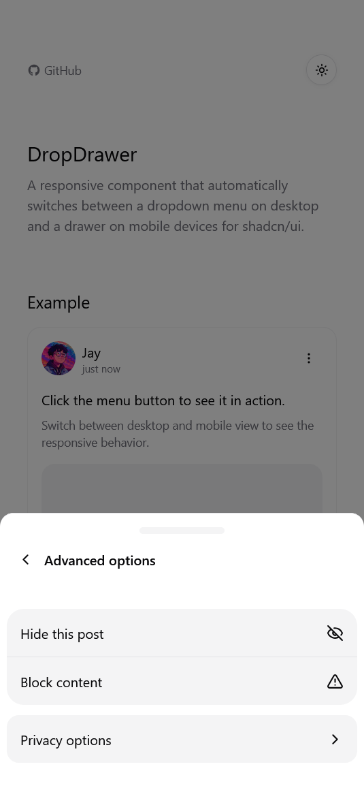

# DropDrawer

[](https://choosealicense.com/licenses/mit/)
[](https://github.com/your-username/dropdrawer)

A responsive component that automatically switches between a dropdown menu on desktop and a drawer on mobile devices for shadcn/ui. It's designed as a drop-in replacement for shadcn/ui's DropdownMenu component.

## Why DropDrawer?

Traditional dropdown menus don't feel native on mobile devices - they can be difficult to interact with on small screens and often create a poor user experience.

**DropDrawer solves this problem by:**

- Automatically switching between dropdown menus on desktop
- Using a native-feeling drawer interface on mobile devices
- Providing consistent interaction patterns across all screen sizes
- Using a responsive breakpoint of 768px (configurable via the hook)

### Desktop View


### Mobile Views

| Main Drawer                            | Submenu Navigation                                 |
| -------------------------------------- | -------------------------------------------------- |
|  |  |

## Installation

### Using shadcn registry (Recommended)

The easiest way to install DropDrawer is through the shadcn registry:

```bash
pnpm dlx shadcn@latest add https://dropdrawer.jiawei.dev/r/drop-drawer.json
```

You can also use npm:

```bash
npx shadcn@latest add https://dropdrawer.jiawei.dev/r/drop-drawer.json
```

During local development, you can use:

```bash
npx shadcn@latest add http://localhost:3000/r/drop-drawer.json
```

This will automatically:

- Install all required dependencies
- Add the component to your project
- Set up all necessary configuration

### Manual Installation

1. Copy the `dropdown-menu` and `drawer` components from shadcn/ui.

```bash
npx shadcn@latest add dropdown-menu drawer
```

Alternatively, if you are not using shadcn/ui cli, you can manually copy the components from [shadcn/ui](https://ui.shadcn.com/docs).

If you copied the drawer component manually, make sure to install vaul:

```bash
npm install vaul
```

2. Copy the `useIsMobile` hook:

<details>
<summary>Click to show code</summary>

```tsx
import * as React from "react";

const MOBILE_BREAKPOINT = 768;

export function useIsMobile() {
  const [isMobile, setIsMobile] = React.useState<boolean | undefined>(
    undefined
  );

  React.useEffect(() => {
    const mql = window.matchMedia(`(max-width: ${MOBILE_BREAKPOINT - 1}px)`);
    const onChange = () => {
      setIsMobile(window.innerWidth < MOBILE_BREAKPOINT);
    };
    mql.addEventListener("change", onChange);
    setIsMobile(window.innerWidth < MOBILE_BREAKPOINT);
    return () => mql.removeEventListener("change", onChange);
  }, []);

  return !!isMobile;
}
```

</details>

3. Copy the `dropdrawer` component:

<details>
<summary>Click to show code</summary>

```tsx
"use client";

import { ChevronRightIcon } from "lucide-react";
import * as React from "react";

import {
  Drawer,
  DrawerClose,
  DrawerContent,
  DrawerFooter,
  DrawerHeader,
  DrawerTitle,
  DrawerTrigger,
} from "@/components/ui/drawer";
import {
  DropdownMenu,
  DropdownMenuContent,
  DropdownMenuItem,
  DropdownMenuLabel,
  DropdownMenuSeparator,
  DropdownMenuSub,
  DropdownMenuSubContent,
  DropdownMenuSubTrigger,
  DropdownMenuTrigger,
} from "@/components/ui/dropdown-menu";
import { useIsMobile } from "@/hooks/use-mobile";
import { cn } from "@/lib/utils";

// Component code here - see full implementation in the repository
```

</details>

4. Update the import paths based on your project structure.

5. Customize the mobile breakpoint (optional):

The default mobile breakpoint is 768px. You can customize this by modifying the `MOBILE_BREAKPOINT` constant in the `use-mobile.ts` hook.

## Usage

### Migrating from DropdownMenu

DropDrawer is designed as a drop-in replacement for shadcn/ui's DropdownMenu component. You can easily migrate your existing DropdownMenu components to DropDrawer with a simple find-and-replace:

1. Replace imports:

```diff
- import { DropdownMenu, DropdownMenuContent, DropdownMenuItem, DropdownMenuTrigger } from "@/components/ui/dropdown-menu";
+ import { DropDrawer, DropDrawerContent, DropDrawerItem, DropDrawerTrigger } from "@/components/ui/dropdrawer";
```

2. Replace component names:

```diff
- <DropdownMenu>
-   <DropdownMenuTrigger>
-   <DropdownMenuContent>
-     <DropdownMenuItem>
+ <DropDrawer>
+   <DropDrawerTrigger>
+   <DropDrawerContent>
+     <DropDrawerItem>
```

The component API is designed to match DropdownMenu, so most props should work without changes.

Here's the mapping between DropdownMenu and DropDrawer components:

| DropdownMenu Component   | DropDrawer Component   |
| ------------------------ | ---------------------- |
| `DropdownMenu`           | `DropDrawer`           |
| `DropdownMenuTrigger`    | `DropDrawerTrigger`    |
| `DropdownMenuContent`    | `DropDrawerContent`    |
| `DropdownMenuItem`       | `DropDrawerItem`       |
| `DropdownMenuLabel`      | `DropDrawerLabel`      |
| `DropdownMenuSeparator`  | `DropDrawerSeparator`  |
| `DropdownMenuGroup`      | `DropDrawerGroup`      |
| `DropdownMenuSub`        | `DropDrawerSub`        |
| `DropdownMenuSubTrigger` | `DropDrawerSubTrigger` |
| `DropdownMenuSubContent` | `DropDrawerSubContent` |

Note: Some advanced DropdownMenu components like `DropdownMenuCheckboxItem`, `DropdownMenuRadioGroup`, and `DropdownMenuRadioItem` are not currently implemented in DropDrawer.

#### Real-world Example: Theme Switcher

Here's how to convert a theme switcher from DropdownMenu to DropDrawer:

```tsx
// Before: Using DropdownMenu
import { Moon, Sun } from "lucide-react";
import { useTheme } from "@/components/theme-provider";
import { Button } from "@/components/ui/button";
import {
  DropdownMenu,
  DropdownMenuContent,
  DropdownMenuItem,
  DropdownMenuTrigger,
} from "@/components/ui/dropdown-menu";

export function ModeToggle() {
  const { setTheme } = useTheme();

  return (
    <DropdownMenu>
      <DropdownMenuTrigger asChild>
        <Button variant="outline" size="icon" className="rounded-full">
          <Sun className="h-[1.2rem] w-[1.2rem] rotate-0 scale-100 transition-all dark:-rotate-90 dark:scale-0" />
          <Moon className="absolute h-[1.2rem] w-[1.2rem] rotate-90 scale-0 transition-all dark:rotate-0 dark:scale-100" />
          <span className="sr-only">Toggle theme</span>
        </Button>
      </DropdownMenuTrigger>
      <DropdownMenuContent align="end">
        <DropdownMenuItem onClick={() => setTheme("light")}>
          Light
        </DropdownMenuItem>
        <DropdownMenuItem onClick={() => setTheme("dark")}>
          Dark
        </DropdownMenuItem>
        <DropdownMenuItem onClick={() => setTheme("system")}>
          System
        </DropdownMenuItem>
      </DropdownMenuContent>
    </DropdownMenu>
  );
}
```

```tsx
// After: Using DropDrawer
import { Moon, Sun } from "lucide-react";
import { useTheme } from "@/components/theme-provider";
import { Button } from "@/components/ui/button";
import {
  DropDrawer,
  DropDrawerContent,
  DropDrawerItem,
  DropDrawerTrigger,
} from "@/components/ui/dropdrawer";

export function ModeToggle() {
  const { setTheme } = useTheme();

  return (
    <DropDrawer>
      <DropDrawerTrigger asChild>
        <Button variant="outline" size="icon" className="rounded-full">
          <Sun className="h-[1.2rem] w-[1.2rem] rotate-0 scale-100 transition-all dark:-rotate-90 dark:scale-0" />
          <Moon className="absolute h-[1.2rem] w-[1.2rem] rotate-90 scale-0 transition-all dark:rotate-0 dark:scale-100" />
          <span className="sr-only">Toggle theme</span>
        </Button>
      </DropDrawerTrigger>
      <DropDrawerContent align="end">
        <DropDrawerItem onClick={() => setTheme("light")}>Light</DropDrawerItem>
        <DropDrawerItem onClick={() => setTheme("dark")}>Dark</DropDrawerItem>
        <DropDrawerItem onClick={() => setTheme("system")}>
          System
        </DropDrawerItem>
      </DropDrawerContent>
    </DropDrawer>
  );
}
```

### Basic Example

Create a simple dropdown/drawer menu with just a few lines of code:

```tsx
import {
  DropDrawer,
  DropDrawerContent,
  DropDrawerItem,
  DropDrawerTrigger,
} from "@/components/ui/dropdrawer";
import { Button } from "@/components/ui/button";

export function Example() {
  return (
    <DropDrawer>
      <DropDrawerTrigger asChild>
        <Button>Open Menu</Button>
      </DropDrawerTrigger>
      <DropDrawerContent>
        <DropDrawerItem>Item 1</DropDrawerItem>
        <DropDrawerItem>Item 2</DropDrawerItem>
        <DropDrawerItem>Item 3</DropDrawerItem>
      </DropDrawerContent>
    </DropDrawer>
  );
}
```

### Using State to Control the Menu

You can control the open state of the menu using React state:

```tsx
import * as React from "react";
import {
  DropDrawer,
  DropDrawerContent,
  DropDrawerItem,
  DropDrawerTrigger,
} from "@/components/ui/dropdrawer";
import { Button } from "@/components/ui/button";

export function StateExample() {
  const [open, setOpen] = React.useState(false);

  const handleOpen = () => {
    setOpen(true);
  };

  return (
    <>
      <Button onClick={handleOpen}>Open with State</Button>

      <DropDrawer open={open} onOpenChange={setOpen}>
        <DropDrawerContent>
          <DropDrawerItem>Item 1</DropDrawerItem>
          <DropDrawerItem>Item 2</DropDrawerItem>
          <DropDrawerItem>Item 3</DropDrawerItem>
        </DropDrawerContent>
      </DropDrawer>
    </>
  );
}
```

### Advanced Usage with Nested Submenus

Create complex navigation structures with nested submenus:

```tsx
import {
  DropDrawer,
  DropDrawerContent,
  DropDrawerItem,
  DropDrawerSub,
  DropDrawerSubContent,
  DropDrawerSubTrigger,
  DropDrawerTrigger,
} from "@/components/ui/dropdrawer";
import { Button } from "@/components/ui/button";

export function NestedExample() {
  return (
    <DropDrawer>
      <DropDrawerTrigger asChild>
        <Button>Open Menu</Button>
      </DropDrawerTrigger>
      <DropDrawerContent>
        <DropDrawerItem>Item 1</DropDrawerItem>
        <DropDrawerSub>
          <DropDrawerSubTrigger>Submenu</DropDrawerSubTrigger>
          <DropDrawerSubContent>
            <DropDrawerItem>Submenu Item 1</DropDrawerItem>
            <DropDrawerItem>Submenu Item 2</DropDrawerItem>
          </DropDrawerSubContent>
        </DropDrawerSub>
        <DropDrawerItem>Item 3</DropDrawerItem>
      </DropDrawerContent>
    </DropDrawer>
  );
}
```

## API Reference

### Component Overview

| Component              | Description                           |
| ---------------------- | ------------------------------------- |
| `DropDrawer`           | Root component that manages state     |
| `DropDrawerTrigger`    | Button that opens the dropdown/drawer |
| `DropDrawerContent`    | Container for dropdown/drawer content |
| `DropDrawerItem`       | Individual menu item                  |
| `DropDrawerSub`        | Container for submenu                 |
| `DropDrawerSubTrigger` | Button that opens a submenu           |
| `DropDrawerSubContent` | Container for submenu content         |
| `DropDrawerSeparator`  | Visual separator between items        |
| `DropDrawerGroup`      | Groups related menu items             |

### DropDrawer

The root component that manages the state of the dropdown/drawer.

| Prop           | Type                      | Description                      |
| -------------- | ------------------------- | -------------------------------- |
| `open`         | `boolean`                 | Controls the open state          |
| `onOpenChange` | `(open: boolean) => void` | Callback when open state changes |
| `children`     | `React.ReactNode`         | The content of the component     |

### DropDrawerTrigger

The button that triggers the dropdown/drawer.

| Prop       | Type              | Description                                   |
| ---------- | ----------------- | --------------------------------------------- |
| `asChild`  | `boolean`         | Whether to merge props with the child element |
| `children` | `React.ReactNode` | The content of the trigger                    |

### DropDrawerContent

The content of the dropdown/drawer.

| Prop        | Type              | Description                        |
| ----------- | ----------------- | ---------------------------------- |
| `className` | `string`          | Additional CSS classes             |
| `children`  | `React.ReactNode` | The content of the dropdown/drawer |

### DropDrawerItem

An item in the dropdown/drawer.

| Prop       | Type                                      | Description                    |
| ---------- | ----------------------------------------- | ------------------------------ |
| `onSelect` | `(event: Event) => void`                  | Callback when item is selected |
| `onClick`  | `React.MouseEventHandler<HTMLDivElement>` | Callback when item is clicked  |
| `icon`     | `React.ReactNode`                         | Icon to display                |
| `variant`  | `"default" \| "destructive"`              | Visual style variant           |
| `inset`    | `boolean`                                 | Whether to add left padding    |
| `disabled` | `boolean`                                 | Whether the item is disabled   |
| `children` | `React.ReactNode`                         | The content of the item        |

## Credits

- [shadcn/ui](https://github.com/shadcn-ui/ui) by [shadcn](https://github.com/shadcn)
- [Vaul](https://github.com/emilkowalski/vaul) by [emilkowalski](https://github.com/emilkowalski)
- [Radix UI](https://www.radix-ui.com/) by Workos
- [Credenza](https://github.com/redpangilinan/credenza) by [redpangilinan](https://github.com/redpangilinan) for the inspiration
